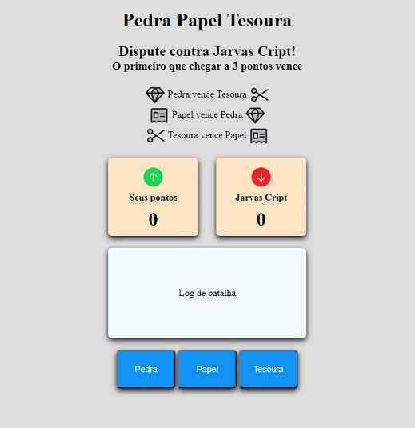

# Pedra Papel e Tesoura
Jogo feito em Javascript.

Permite jogar 'Pedra Papel e Tesoura' contra um adversário controlado pelo computador.

Live preview: 
[Clique aqui para acessar](https://lcarrati.github.io/PedraPapelTesoura/) 

&nbsp;
> Dispute contra um oponente criado em Javascript
- Usuário escolhe uma opção a cada rodada
- Oponente escolhe uma opção aletatória a cada rodada
- Quem atingir 3 pontos primeiro vence a partida

&nbsp;
## Tecnologias utilizadas

> Javascript Vanilla
- Operador Math
- Manipulação do DOM
- Funções
- Eventos
- Arrays
- Condicionais if/else

> CSS
- Flexbox

> Ferramentas
- Visual Studio Code
- Git & Github

&nbsp;
## Resultado
- **Elementos semanticos** do HTML5 foram utilizados para estruturar a página.
- **Flexbox** do CSS3 foi utilizado para criar o layout.
- **Git e GitHub** foi utilizado para versionamento e publicação.
- Código refatorado para tentar atingir **clean code**. 

&nbsp;
## Jogue uma partida! 
[Clique aqui para acessar](https://lcarrati.github.io/PedraPapelTesoura/) 

&nbsp;

